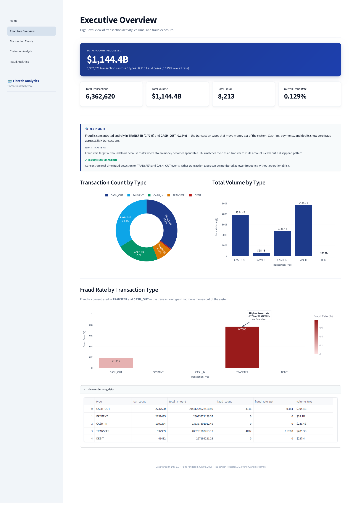

# Fintech Transaction Analytics

**Live dashboard:** https://fintech-analytics-ajjjr7c7hzkzkutu9cefgu.streamlit.app

A business intelligence dashboard analyzing 6.3M mobile money transactions, built around a specific mandate: **reduce fraud-investigation false positives without losing catch rate.** The headline finding — a single high-precision rule (Risk Score 1) catches 76% of all fraud at 97% precision, while adding a second noisy signal (Risk Score 2) inflates flagged volume to 2.5M with almost no precision — drives a concrete recommendation to drop the balance-mismatch signal from the scoring model.

The value here is the **analytical framework** — how to structure and evaluate a fraud-scoring model against a precision/recall tradeoff — which transfers directly to any labeled transaction stream.



📸 **[See all five dashboard pages →](docs/)**

---

## Key Findings

| Finding | Value |
|---|---|
| Total transaction volume | $1,144.4B across 31 days |
| Fraud rate | 0.129% overall (8,213 fraud cases) |
| Fraud concentration | 100% in TRANSFER (0.77%) and CASH_OUT (0.18%) |
| Risk Score 1 precision | **97%** — 6,218 of 6,409 flags are real fraud |
| Risk Score 1 recall (catch rate) | **76%** — catches 6,218 of 8,213 total fraud cases |
| Risk Score 2 false positives | **2.5M** flagged, ~0% precision |
| Full system recall | **98%** — all signals combined catch 8,053 of 8,213 (160 missed entirely) |
| Tier 1 volume concentration | Top 25% of customers control **83.8%** of total volume |

**The core insight:** adding more risk signals does not improve precision — it *dilutes* the score when one signal is noisy. Risk Score 1 alone catches 76% of all fraud while keeping investigators focused on just 6,409 transactions. Layering on the balance-mismatch signal (Score 2) adds 2.5M flagged transactions with near-zero precision — burying the same real fraud under a mountain of false positives. The recommendation is to drop or down-weight that signal rather than treating "more flags" as "better detection."

---

## How Risk Scoring Works

Each TRANSFER and CASH_OUT transaction (the only types where fraud occurs in this dataset) is scored against three rule-based signals. The risk score is the count of signals triggered (1–3).

| Signal | Rule | Quality |
|---|---|---|
| **Large amount** | Transaction exceeds the 99th-percentile amount for its type | High precision |
| **Account drained** | Sender's new balance is 0 while amount > 0 | High precision |
| **Balance mismatch** | `old_balance − amount ≠ new_balance` (with $1 tolerance) | **Low precision — fires on most legitimate transactions** |

The balance-mismatch signal is the problem. It triggers on nearly every TRANSFER/CASH_OUT regardless of fraud, which is why Risk Score 2 (two signals, almost always including this one) balloons to 2.5M flagged transactions. Score 1 — driven by the two high-precision signals — is the signal worth acting on.

**Validating the recommendation:** dropping the balance-mismatch signal would collapse flagged volume from ~2.5M to ~6.4K transactions while retaining the same 6,218 true-fraud catches — a ~99.7% reduction in investigator workload at no cost to Score 1 catch rate. The 160 fraud cases the system misses entirely (2% of total) trigger none of the three signals and would require a new rule or a model-based approach to surface.

---

## Dataset

**PaySim** — a synthetic mobile money transaction dataset simulating 31 days of activity across 6,362,620 transactions. Publicly available on Kaggle.

> ⚠️ This is synthetic data. Anomalies (e.g., days 3–5 volume drops) are simulation artifacts, not real business events, and the fraud labels are simulator-generated. The project demonstrates analytical methodology rather than real-world fraud discovery — every insight is framed accordingly.

---

## Architecture

The pipeline uses a **deliberate dual-database design**: the full materialized views (9.4M rows) live in local PostgreSQL for development, while the dashboard queries pre-aggregated summary tables (~500 rows) on Neon. This was a conscious cost/performance decision — serving 9.4M rows from a free-tier cloud database would be slow and exceed storage limits, so all dashboard queries are pre-computed into compact `deploy_*` tables. The live app and the local pipeline run identical logic; only the query target differs.

```
paysim.csv (6.3M rows)
    │
    ▼
src/etl/load_raw_data.py          # EXTRACT + LOAD
    │  TRUNCATE before load (idempotent — prevents double-loads)
    │  Chunked inserts (5,000 rows) — avoids PostgreSQL 65,535 param limit
    ▼
raw_transactions (PostgreSQL)
    │
    ▼
sql/transformations/              # TRANSFORM
    ├── 01_dim_customers.sql      # 6.9M customer dimension (NTILE tiers)
    ├── 02_fact_daily_metrics.sql # 152-row daily aggregates + window functions
    ├── 03_fact_customer_cohorts.sql
    └── 04_fact_fraud_signals.sql # Rule-based risk scoring (signals 1–3)
    │
    ▼
export_for_cloud.py               # Pre-aggregate for cloud deployment
    │  9 deploy_ tables (~500 rows total)
    ▼
Neon PostgreSQL (cloud)           # Free-tier compatible (< 1MB)
    │
    ▼
src/dashboard/                    # Streamlit multi-page app
    ├── Home.py
    ├── pages/1_Executive_Overview.py
    ├── pages/2_Transaction_Trends.py
    ├── pages/3_Customer_Analysis.py
    └── pages/4_Fraud_Analytics.py
```

---

## Engineering Notes

**Bug: 2× data duplication**
The ETL used `if_exists="append"` with no guard, so re-running it doubled the raw table (12.7M rows instead of 6.36M). Every downstream KPI was doubled — Executive Overview showed 12.7M transactions while the Home page showed 6.36M, creating an inconsistent story across pages. Fixed by switching to `TRUNCATE` before each load, making the ETL fully idempotent.

**Bug: PostgreSQL parameter limit**
Initial ETL used 100,000-row chunks. With 11 columns, that's 1.1M parameters per INSERT — exceeding PostgreSQL's hard limit of 65,535. Reduced chunk size to 5,000 rows (55,000 parameters) to stay safely under the limit.

**Cloud deployment: storage constraint**
Supabase free tier (500MB) cannot hold the full 6.9M-row `dim_customers` or 2.5M-row `fact_fraud_signals` views. Solution: pre-aggregate all dashboard queries into 9 `deploy_*` tables totaling ~500 rows. The dashboard queries these tiny summary tables on Neon (cloud PostgreSQL), while the full materialized views stay local for development.

**Cloud deployment: Python 3.14 compatibility**
Streamlit Cloud defaulted to Python 3.14, which has no compiled wheels for `psycopg2-binary`. Switched to `pg8000`, a pure-Python PostgreSQL driver that works on any Python version without compilation.

---

## A Note on the Customer Fraud-Exposure Count

The Customer Analysis page reports **16,382 fraud-exposed customers** against 8,213 fraud transactions. This is expected, not a discrepancy: each fraud transaction has both a sender and a receiver, and both parties are flagged as fraud-exposed. Roughly 2 × 8,213 = ~16,400 accounts touch a fraud event, slightly reduced by customers involved in more than one.

---

## Dashboard Pages

| Page | Focus |
|---|---|
| [Home](docs/01-home.png) | Dataset overview and entry point |
| [Executive Overview](docs/02-executive-overview.png) | Headline KPIs and transaction-type breakdown |
| [Transaction Trends](docs/03-transaction-trends.png) | Daily volume, rolling averages, growth |
| [Customer Analysis](docs/04-customer-analysis.png) | Volume tiers, behavior segments, fraud exposure |
| [Fraud Analytics](docs/05-fraud-analytics.png) | Risk scoring, precision/recall analysis, suspicious transactions |

---

## Stack

| Layer | Technology |
|---|---|
| Data | PaySim (synthetic, 6.3M rows) |
| Database (local) | PostgreSQL 16 |
| Database (cloud) | Neon (serverless PostgreSQL) |
| ETL | Python, pandas, SQLAlchemy |
| Transformations | SQL (materialized views, window functions) |
| Dashboard | Streamlit, Plotly |
| Deployment | Streamlit Community Cloud |

---

## Running Locally

```bash
# 1. Clone and install
git clone https://github.com/glcapitan/fintech-analytics.git
cd fintech-analytics
pip install -r requirements.txt

# 2. Configure credentials
# Create a .env file with your PostgreSQL connection details:
# DB_HOST=localhost
# DB_PORT=5432
# DB_NAME=fintech_analytics
# DB_USER=postgres
# DB_PASSWORD=your_password

# 3. Load data (requires paysim.csv in data/)
python src/etl/load_raw_data.py

# 4. Build materialized views
python run_transformations.py

# 5. Run dashboard
cd src/dashboard
streamlit run Home.py
```

---

## Project Structure

```
fintech-analytics/
├── src/
│   ├── etl/
│   │   └── load_raw_data.py       # ETL pipeline
│   └── dashboard/
│       ├── Home.py                # Landing page
│       ├── db.py                  # Database connection helper
│       ├── theme.py               # Plotly theme
│       ├── ui.py                  # Reusable UI components
│       └── pages/
│           ├── 1_Executive_Overview.py
│           ├── 2_Transaction_Trends.py
│           ├── 3_Customer_Analysis.py
│           └── 4_Fraud_Analytics.py
├── sql/
│   └── transformations/           # 4 materialized view definitions
├── cloud_data/                    # Pre-aggregated CSVs for cloud deploy
├── docs/                          # Dashboard page screenshots
├── export_for_cloud.py            # Generates deploy_ tables locally
├── load_to_neon.py                # Uploads deploy_ tables to Neon
├── run_transformations.py         # Rebuilds all materialized views
├── diagnose.py                    # Row count sanity checks
└── requirements.txt
```
